# Business Processes

> Generated: 2026-04-10
> Source files: `docs/multivendor-ecommerce-requirements.pdf` (Xiteb SRS – Multivendor eCommerce Platform, 19 pages)
> Traceability Matrix: [requirement-traceability.md](./requirement-traceability.md)
> QA Backlog: [question-backlog.md](./question-backlog.md)

---

## BP-001: Vendor Onboarding & Verification

**Objective:** Enable a new vendor to register, complete KYC verification, and become activated to list products.
**Actors:** Vendor, Admin, System
**Source:** §3.1, §3.2, §3.3, §3.5
**Related BRs:** BR-023, BR-024, BR-025, BR-026, BR-027, BR-028, BR-029
**Related Rules:** RULE-002, RULE-003, RULE-004, RULE-005, RULE-006, RULE-007, RULE-008, RULE-009, RULE-010, RULE-012, RULE-053, RULE-065, RULE-068, RULE-069, RULE-070, RULE-071

### Activity Flow

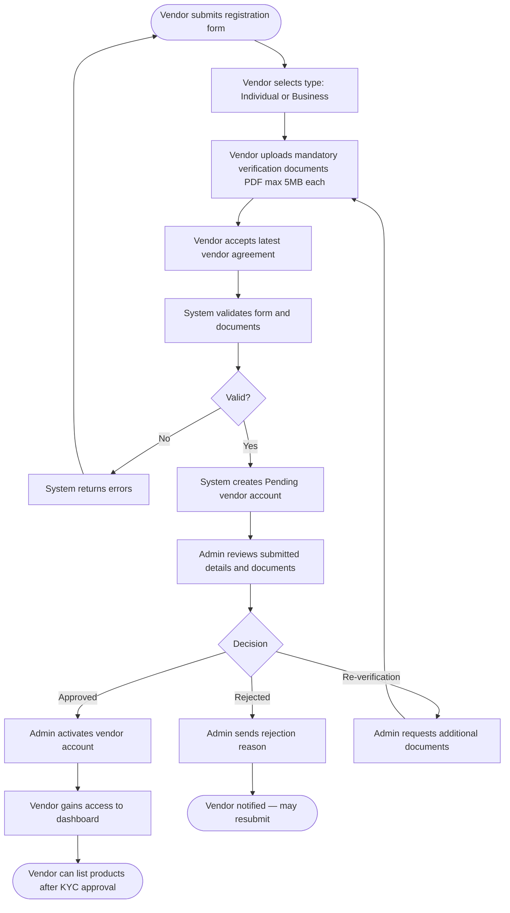

### Activity Detail

| Step | Actor | Description | Rule | Notes |
|------|-------|-------------|------|-------|
| Submit registration form | Vendor | Personal or business details; select Individual or Business type | RULE-002 | All fields mandatory |
| Upload documents | Vendor | Individual: NIC/Passport, bank proof, verified email+mobile; Business: BR cert, Form 1/20, TIN/VAT, NIC of director, company bank proof | RULE-003, RULE-053 | PDF format; 5MB max per document |
| Accept vendor agreement | Vendor | Must accept latest published agreement version. Acceptance checkbox is disabled until vendor scrolls to the bottom of the agreement container (scroll-to-unlock). Agreement rendered in rich HTML/Markdown formatting | RULE-002, RULE-068, RULE-069 | Acceptance date and version logged; stale version blocks submission |
| System validation | System | Frontend validates step-by-step; backend aggregates all errors across all steps simultaneously in one round-trip | RULE-003, RULE-053, RULE-071 | Returns inline errors on failure; session expires after 30–60 min inactivity (RULE-070) |
| Admin review | Admin | Manually reviews documents and details | RULE-004, RULE-005 | Single-step approval process |
| Approve / Reject / Re-verify | Admin | Decision with mandatory remarks | RULE-010 | All actions logged |
| Vendor activation | System | Grants vendor dashboard access; bank details locked post-activation | RULE-007, RULE-009 | Bank details mandatory before activation |
| Product listing permission | System | Enabled only after KYC approval | RULE-006 | Agreement must be current (RULE-012) |

---

### Vendor Status Lifecycle

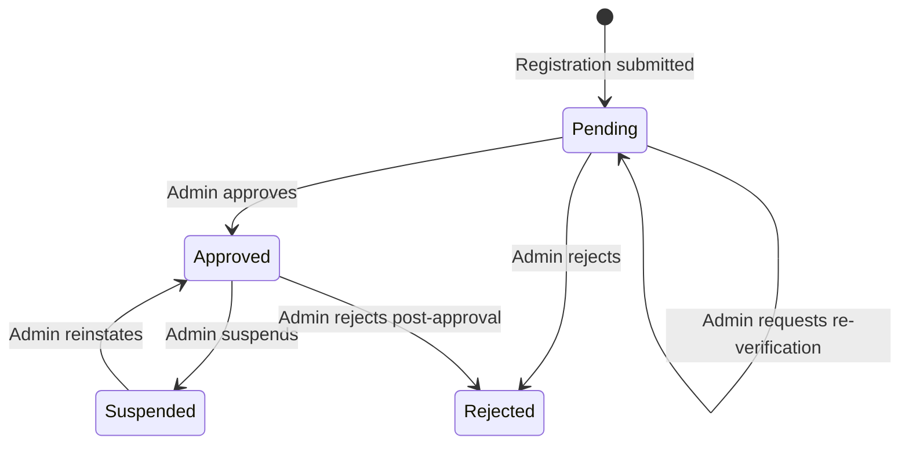

### Vendor State Detail

| State | Description | Entry Condition | Exit Condition |
|-------|-------------|----------------|----------------|
| Pending | Account created, awaiting Admin decision | Registration + documents submitted | Admin approves, rejects, or requests re-verification |
| Approved | Active vendor; can list products and receive orders | Admin approves KYC | Suspended or rejected |
| Rejected | KYC failed or non-compliant | Admin rejects | Vendor resubmits (new registration flow) |
| Suspended | Account frozen; products and order processing paused | Admin action | Admin reinstates |

---

## BP-002: Product Listing & Approval

**Objective:** Enable vendors to create and publish product listings after Admin approval.
**Actors:** Vendor, Admin, System
**Source:** §4.1, §4.2, §4.3
**Related BRs:** BR-032, BR-033, BR-034, BR-035, BR-036, BR-037, BR-038, BR-039
**Related Rules:** RULE-006, RULE-013, RULE-014, RULE-055

### Activity Flow

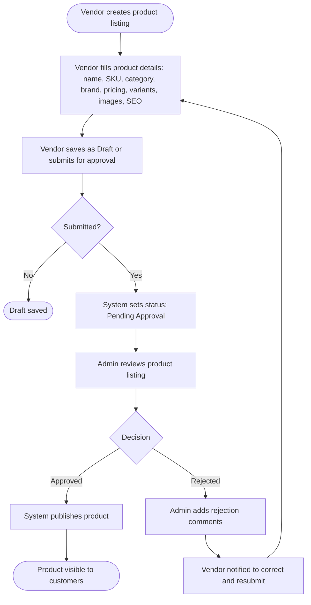

### Activity Detail

| Step | Actor | Description | Rule | Notes |
|------|-------|-------------|------|-------|
| Create product | Vendor | Fill name, SKU, description, category, brand, pricing, inventory, variants, warranty, weight, dimensions, images, SEO metadata | RULE-006 | KYC must be approved |
| Bulk import | Vendor | Import via CSV | — | Export also supported |
| Submit for approval | Vendor | Changes status to Pending Approval | RULE-014 | — |
| Admin review | Admin | Approve or reject with comments | RULE-013 | All decisions logged |
| Publish | System | Status set to Published; visible to customers | RULE-014 | — |
| Resubmit after rejection | Vendor | Correct per Admin comments and resubmit | RULE-013 | — |
| Archive | Vendor/Admin | Vendor-initiated or Admin force-archive for violations; NOT automatic on zero stock | RULE-014, RULE-055 | — |

---

### Product Status Lifecycle

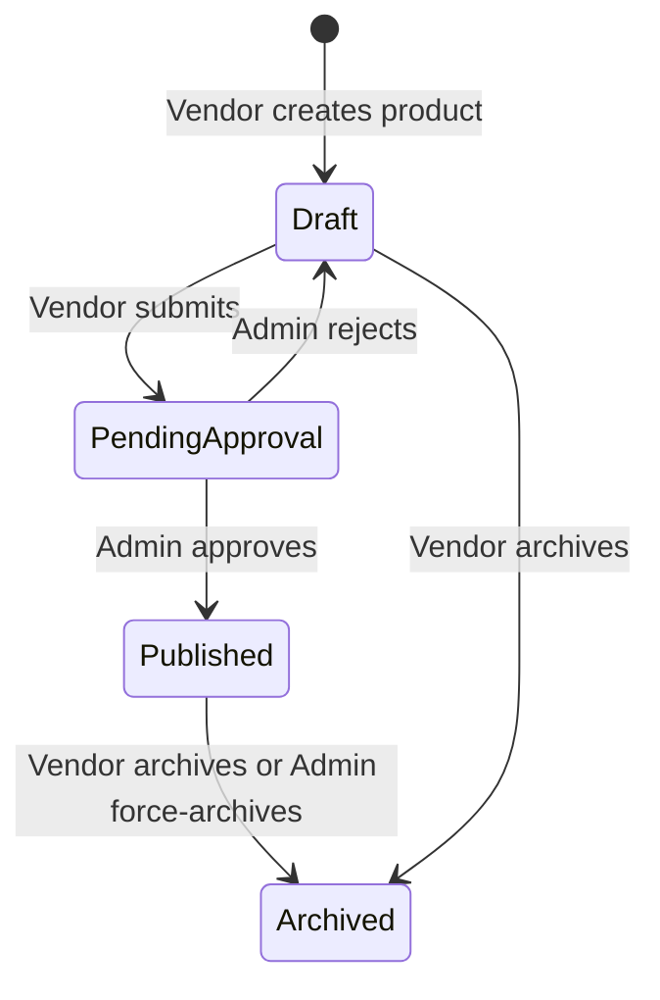

---

## BP-003: Customer Order Placement & Checkout

**Objective:** Enable customers to discover products, add to cart, and complete a multi-vendor checkout.
**Actors:** Customer, System
**Source:** §6.1, §6.2, §6.3
**Related BRs:** BR-059, BR-060, BR-061, BR-062, BR-063, BR-064, BR-065, BR-066, BR-067, BR-068, BR-100
**Related Rules:** RULE-015, RULE-016, RULE-017, RULE-021, RULE-054, RULE-056, RULE-057, RULE-059

### Activity Flow

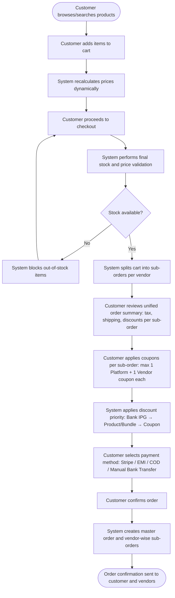

### Activity Detail

| Step | Actor | Description | Rule | Notes |
|------|-------|-------------|------|-------|
| Add to cart | Customer | Single cart across multiple vendors | — | Cart persists for logged-in users |
| Dynamic price recalculation | System | Reflects promotions and price changes | — | — |
| Final validation | System | Stock and price check at checkout | BR-064 | Blocks purchase if invalid |
| Cart split | System | Divides cart into vendor-wise sub-orders | BR-069, RULE-057 | Each sub-order allows up to 2 coupons (1 Platform + 1 Vendor) |
| Discount application | System | Apply in priority order: Bank IPG → Product/Bundle → Coupon | RULE-016, RULE-017 | Full price breakdown displayed |
| Payment selection | Customer | Stripe (primary gateway), EMI, COD, Manual Bank Transfer | BR-065–068, RULE-054 | Stripe is the sole gateway provider |
| Order split | System | Master order auto-split into vendor sub-orders | BR-069 | Vendors see only their sub-orders |
| Abandoned cart | System | 2-hour idle triggers automated email notification | BR-062, BR-100, RULE-059 | — |

---

## BP-004: Order Fulfillment & Status Management

**Objective:** Enable vendors to fulfill orders and customers to track delivery.
**Actors:** Vendor, Admin, Customer, System
**Source:** §7.1, §7.2, §7.3
**Related BRs:** BR-069, BR-070, BR-071, BR-072, BR-073, BR-075
**Related Rules:** RULE-048, RULE-011, RULE-058, RULE-060

### Activity Flow

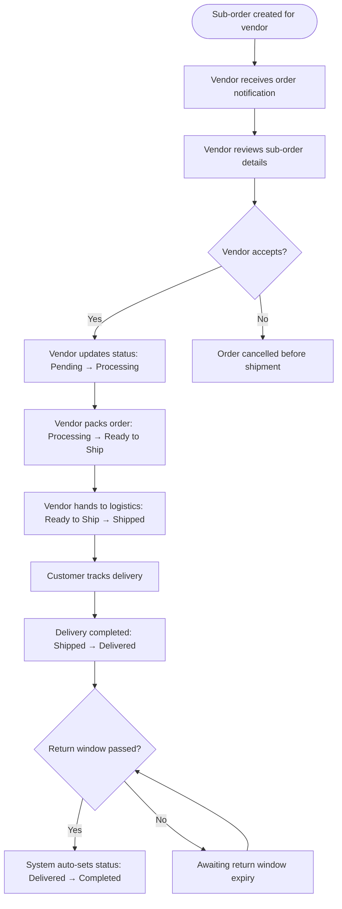

### Activity Detail

| Step | Actor | Description | Rule | Notes |
|------|-------|-------------|------|-------|
| Sub-order creation | System | Auto-split from master order | BR-069 | Vendor sees only own sub-order |
| Order notification | System | Real-time email to vendor | COMMON-004 | — |
| Status: Pending → Processing | Vendor | Vendor accepts and begins processing | RULE-058 | — |
| Status: Processing → Ready to Ship | Vendor | Vendor packs order | RULE-058 | — |
| Status: Ready to Ship → Shipped | Vendor | Handed to logistics | RULE-058 | — |
| Status: Shipped → Delivered | System/Logistics | Confirmed delivery to customer address | RULE-058, RULE-060 | Direct address only; no collection points |
| Status: Delivered → Completed | System | Auto-transition after return window expires | RULE-058 | — |
| Cancellation | Customer/Vendor | Allowed only before shipment (Pending/Processing) | RULE-058 | Sets status to Cancelled |
| Customer tracking | System | Unified tracking view across all vendors | BR-071 | — |
| Cancellation/Return reasons | Admin/Vendor | Configurable list | BR-073 | — |

---

### Order Status Lifecycle

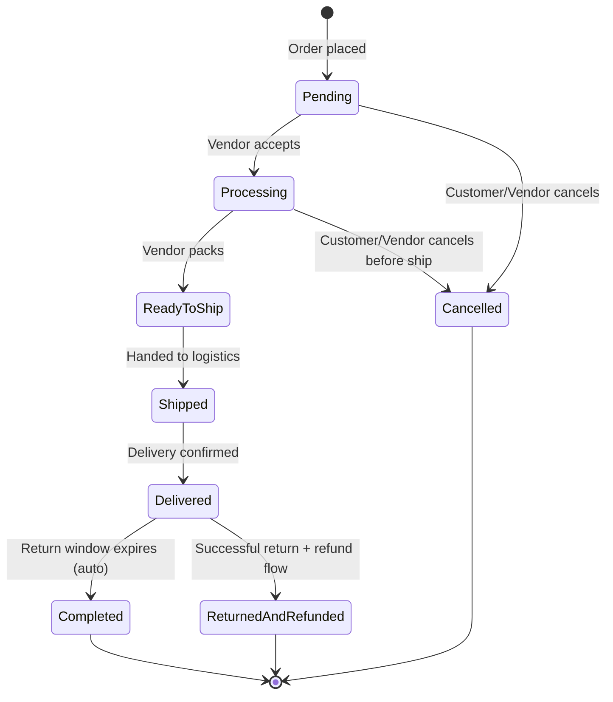

### Order State Detail

| State | Description | Entry Condition | Exit Condition | Actor |
|-------|-------------|----------------|----------------|-------|
| Pending | Order placed, awaiting vendor action | Order confirmed at checkout | Vendor accepts (→ Processing) or cancellation | System |
| Processing | Vendor is preparing the order | Vendor accepts order | Vendor packs (→ Ready to Ship) or cancellation | Vendor |
| Ready to Ship | Order packed, awaiting logistics pickup | Vendor marks packed | Handed to logistics (→ Shipped) | Vendor |
| Shipped | In transit to customer | Logistics handoff | Delivery confirmed (→ Delivered) | System/Logistics |
| Delivered | Successfully delivered to customer | Delivery confirmation | Return window expires (→ Completed) or return initiated | System |
| Completed | Order finalized; return window closed | Auto after return window expiry | Terminal state | System |
| Cancelled | Order cancelled before shipment | Customer/Vendor cancellation before ship | Terminal state | Customer/Vendor |
| Returned and Refunded | Successful return + refund completed | Return approved, item received, refund issued | Terminal state | System |

---

## BP-005: Returns & Refunds

**Objective:** Allow customers to return eligible products and receive refunds within platform policy.
**Actors:** Customer, Vendor, Admin, System
**Source:** §8.1, §8.2, §8.3, §8.4, §8.5
**Related BRs:** BR-076, BR-077, BR-078, BR-079, BR-080, BR-081
**Related Rules:** RULE-031, RULE-032, RULE-033, RULE-034, RULE-035, RULE-036, RULE-037, RULE-038, RULE-039, RULE-040, RULE-041, RULE-061

### Activity Flow

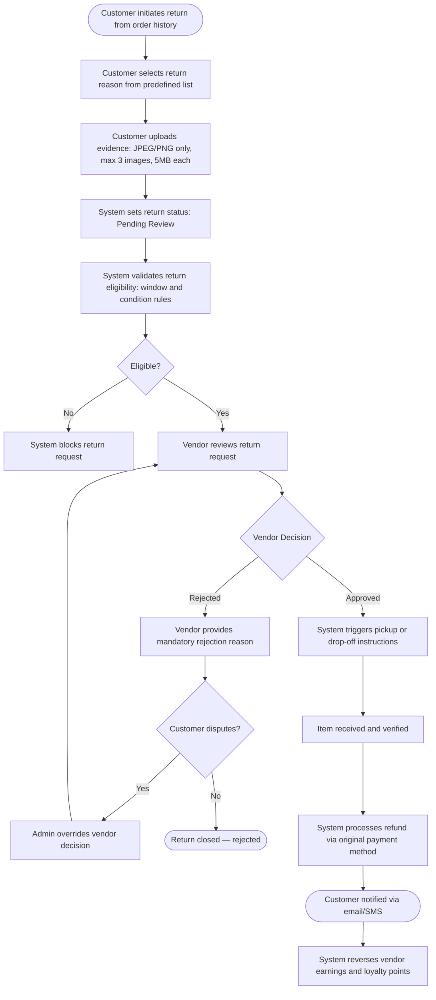

### Activity Detail

| Step | Actor | Description | Rule | Notes |
|------|-------|-------------|------|-------|
| Initiate return | Customer | From order history; select reason + upload evidence | BR-077, RULE-061 | JPEG/PNG only, max 3 images, 5MB each |
| Eligibility check | System | Validate against return window and product condition | RULE-031, RULE-033 | Non-returnable products blocked per RULE-032 |
| Vendor review | Vendor | Approve or reject with mandatory remarks | RULE-034 | All actions logged |
| Admin override | Admin | Override vendor in dispute scenarios | BR-078 | — |
| Refund processing | System | After item verification; via original payment method | RULE-036, RULE-037 | COD refunds manual via bank transfer |
| Financial reversal | System | Reverse vendor earnings, loyalty points; apply discount funding rules | RULE-038–041 | — |
| Customer notification | System | Email/SMS for refund status | COMMON-003 | — |

---

### Return Status Lifecycle

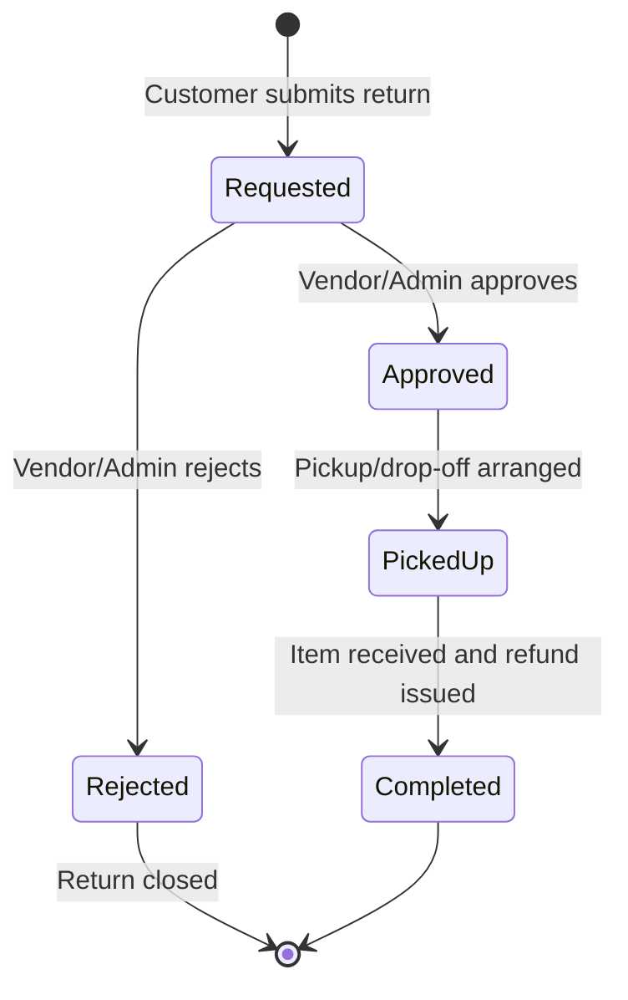

---

## BP-006: Commission Calculation & Vendor Settlement

**Objective:** Calculate platform commissions and settle vendor earnings after order completion.
**Actors:** Admin, System, Vendor
**Source:** §9.1, §9.2, §9.3, §9.4, §9.5
**Related BRs:** BR-082, BR-083, BR-084, BR-085, BR-086, BR-087, BR-088, BR-101
**Related Rules:** RULE-018, RULE-019, RULE-020, RULE-021, RULE-022, RULE-023, RULE-024, RULE-025, RULE-026, RULE-027, RULE-028, RULE-029, RULE-030, RULE-062

### Activity Flow

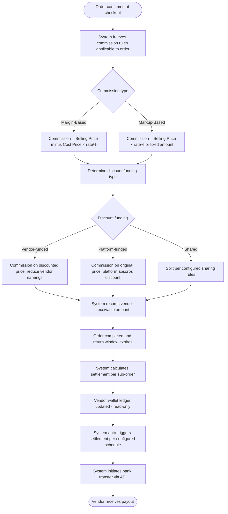

### Activity Detail

| Step | Actor | Description | Rule | Notes |
|------|-------|-------------|------|-------|
| Freeze commission | System | Lock commission rules at checkout | RULE-021 | — |
| Commission calculation | System | Margin-based or markup-based per highest-priority rule | RULE-018, RULE-019, RULE-020 | Cost price visible to Admin only (RULE-022) |
| Discount impact | System | Adjust commission based on discount funding type | RULE-023, RULE-024, RULE-025 | — |
| Settlement eligibility | System | After order completion + return window expiry | RULE-026 | — |
| Settlement cycle | System | Automated per admin-configured schedule (weekly/bi-weekly/monthly) | RULE-027, RULE-062 | System auto-triggers transfers |
| Payout initiation | System | Automated bank transfer via API | RULE-062 | Replaces previous manual Admin initiation |
| Audit logging | System | All transactions logged immutably | RULE-029, RULE-030 | Supports ERP reconciliation |

---

## BP-007: Customer Loyalty Points

**Objective:** Reward customers with loyalty points for purchases and allow redemption as discounts.
**Actors:** Customer, System, Admin
**Source:** §11.3
**Related BRs:** BR-095, BR-096
**Related Rules:** RULE-039, RULE-045, RULE-046

### Activity Flow

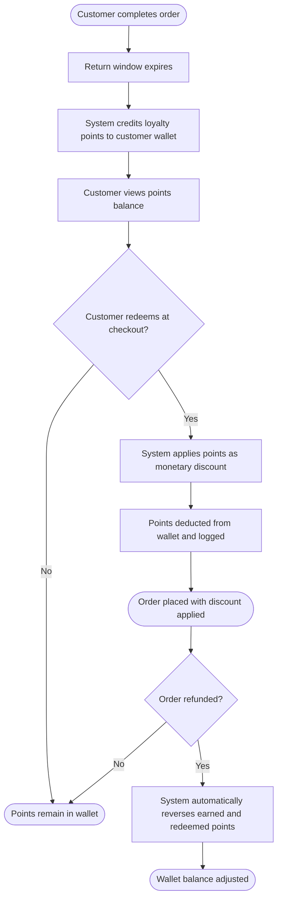

### Activity Detail

| Step | Actor | Description | Rule | Notes |
|------|-------|-------------|------|-------|
| Earn points | System | Based on order value, campaigns, or specific actions | RULE-045 | Credited only after return window expires |
| Redeem points | Customer | At checkout as monetary discount | — | Redemption limits per order configurable |
| Restriction | System | Points cannot be redeemed on restricted categories or promotions | — | Which categories are restricted → QA-014 (Deferred) |
| Reversal on refund | System | Automatically reverse earned and redeemed points | RULE-039, RULE-046 | — |
| Expiry | System | Points expiry rules configurable by Admin | — | Expiry logic not specified → QA-015 (Deferred) |

---

## BP-008: ERP Integration

**Objective:** Synchronize inventory and order data with vendor ERP systems.
**Actors:** System, Vendor
**Source:** §12
**Related BRs:** BR-098, BR-099
**Related Rules:** RULE-063

### Activity Flow

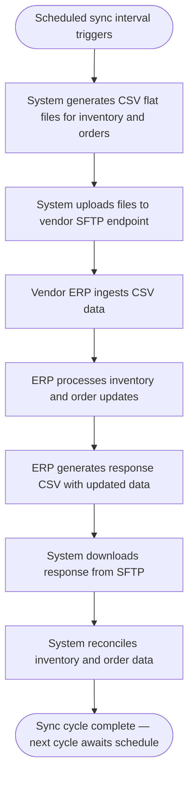

### Activity Detail

| Step | Actor | Description | Rule | Notes |
|------|-------|-------------|------|-------|
| Sync trigger | System | Scheduled interval (configurable) | RULE-063 | CSV flat-file format |
| Data exchange | System/ERP | SFTP-based file transfer; no custom API per vendor | RULE-063 | Covers most legacy ERPs |
| Data scope | System | Inventory and order data | BR-098, BR-099 | ERP as source of truth for inventory |

---

## Changelog

| Date | Source | Changes | QA Resolved |
|------|--------|---------|-------------|
| 2026-04-11 | `meeting-transcript-1104.md` | Updated BP-001 (doc size limit 5MB, RULE-053/065 refs); Updated BP-002 (archive conditions per RULE-055); Updated BP-003 (Stripe gateway, coupon stacking per sub-order, abandoned cart email); Rewrote BP-004 (full 8-state order lifecycle, removed collection points); Updated BP-005 (return evidence constraints); Updated BP-006 (automated settlement via API); Added BP-008 (ERP Integration via SFTP/CSV) | QA-001, QA-002, QA-003, QA-004, QA-005, QA-006, QA-007, QA-008, QA-009, QA-010, QA-011, QA-012, QA-013, QA-017, QA-018, QA-019, QA-020 |
| 2026-04-13 | `Vendor Onboarding QA Answers.csv` | Updated BP-001 Related Rules (added RULE-068, 069, 070, 071); updated Accept vendor agreement detail (scroll-to-unlock, rich text); updated System validation detail (backend aggregation, session timeout) | QA-021, QA-022, QA-023, QA-024, QA-025, QA-026, QA-027, QA-028, QA-029, QA-030, QA-031, QA-032, QA-033, QA-034 |
