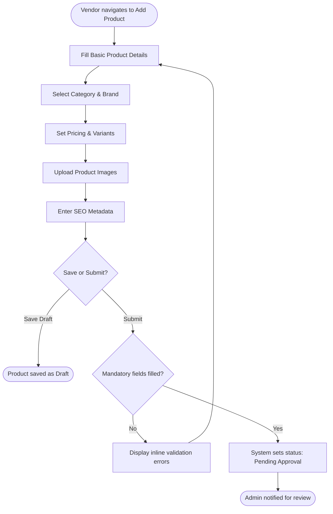
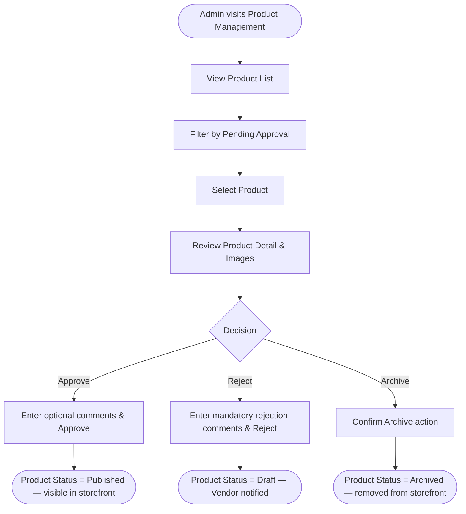
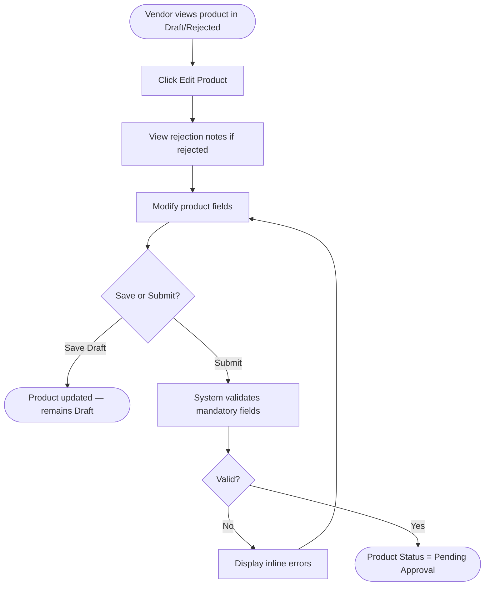
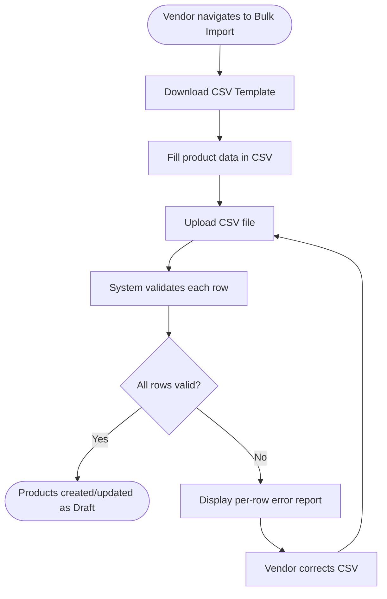
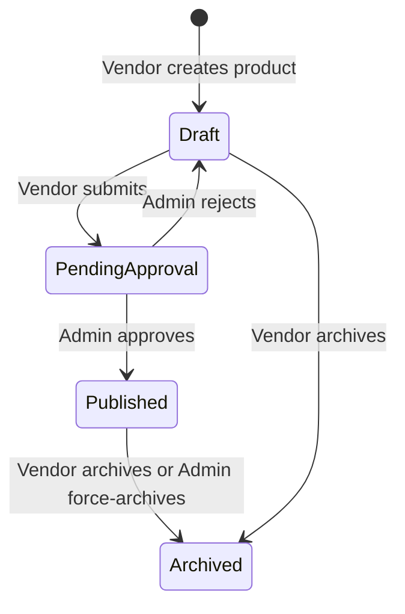

# Wireframes: Product Listing & Approval

> Title: Wireframes — Product Listing & Approval
> Date Created: 2026-04-15
> Author: Antigravity Agent
> Version: v1
> Module: BP-002 Product Listing & Approval
> Source: [business-processes.md](./business-processes.md), [usecase-list.md](./usecase-list.md), [entity-model.md](./entity-model.md), [common-rules.md](./common-rules.md)

---

## 1. Task Flows

### 1.1 Product Creation & Submission Flow (Vendor Actor)



### 1.2 Product Approval Flow (Admin Actor)



### 1.3 Product Edit & Resubmission Flow (Vendor Actor)



### 1.4 Bulk Import Flow (Vendor Actor)



### 1.5 Product Status Lifecycle



---

## 2. Low-Fidelity Wireframes

### 2.1 Screen: Create Product Listing (UC-PLA-001)

This screen allows the vendor to create a new product listing with all required details.

```text
+-----------------------------------------------------------------------------+
|  [Logo]   MultiVendor Platform                    [Notifications] [Profile]  |
+-----------------------------------------------------------------------------+
|  [Menu]  |  Products > Add New Product                                      |
|  Dash    |                                                                  |
|  Products|  Create New Product                                              |
|  Orders  |                                                                  |
|  Earnings|  [1. Basic Info] -- [2. Pricing & Variants] -- [3. Images & SEO] |
|  Settings|                                                                  |
|          |  Product Name *                                          [1]     |
|          |  [Input Product Name                                 ]           |
|          |                                                                  |
|          |  SKU *                                                           |
|          |  [Input SKU                                           ]  [2]     |
|          |                                                                  |
|          |  Category *                            Brand                     |
|          |  [Select Category       (v)]           [Select Brand       (v)]  |
|          |                                        [3]                       |
|          |  Description                                                     |
|          |  +-------------------------------------------------------------+|
|          |  | [Rich Text Editor — max 2000 chars]                         ||
|          |  |                                                             ||
|          |  +-------------------------------------------------------------+|
|          |  [4]                                                             |
|          |                                                                  |
|          |  Warranty Description                                            |
|          |  [Input Warranty Info                                 ]          |
|          |                                                                  |
|          |  Weight (kg)             Dimensions (L × W × H cm)               |
|          |  [Input Weight  ]        [L    ] × [W    ] × [H    ]    [5]      |
|          |                                                                  |
|          |  Is Returnable?  (o) Yes  ( ) No                       [6]       |
|          |                                                                  |
|          |          [ Save as Draft ]            [ Next Step -> ]  [7]      |
+-----------------------------------------------------------------------------+
```

**Annotations & Rules:**

* **[1] Product Name:** Required field. Max 255 characters (COMMON-001). Placeholder: "Input Product Name" (COMMON-010). Marked with `*` (COMMON-003).
* **[2] SKU:** Required field, must be unique per vendor (ENT-007, attr 4). Uniqueness validated server-side. Duplicate triggers error: "SKU already exists" (COMMON-029).
* **[3] Category & Brand:** Dropdowns with placeholder "Select {field_name}" (COMMON-005). Category is required; Brand is optional. Category supports 3-level hierarchy: Category > Sub-Category > Sub-Sub-Category (BR-032). Brand is populated from Admin-managed global list (BR-033).
* **[4] Description:** Rich text editor (COMMON-002, max 2000 chars). Input ceases at max length (COMMON-009).
* **[5] Weight & Dimensions:** Numeric-only fields — reject non-numeric input on keypress (COMMON-004). Optional fields for shipping calculation.
* **[6] Is Returnable:** Default = Yes. Admin may override at category level (RULE-032). Products marked as non-returnable display a badge on storefront.
* **[7] Save/Next:** "Save as Draft" persists product in Draft status without validation (UC-PLA-001 post-condition). "Next Step" validates current tab fields and moves to Pricing & Variants. Inline errors shown below each field (COMMON-032).

---

### 2.2 Screen: Pricing & Variants (UC-PLA-001 — Tab 2)

```text
+-----------------------------------------------------------------------------+
|  [Logo]   MultiVendor Platform                    [Notifications] [Profile]  |
+-----------------------------------------------------------------------------+
|  [Menu]  |  Products > Add New Product                                      |
|          |                                                                  |
|          |  [1. Basic Info] -- [2. Pricing & Variants] -- [3. Images & SEO] |
|          |                                                                  |
|          |  Pricing                                                         |
|          |  +-------------------------------------------------------------+ |
|          |  | Unit Price (LKR) *           Cost Price (LKR)        [1]   | |
|          |  | [Input Unit Price    ]       [Input Cost Price     ]       | |
|          |  +-------------------------------------------------------------+ |
|          |                                                                  |
|          |  Product Variants                                       [2]      |
|          |  +-------------------------------------------------------------+ |
|          |  | Variant Name    | Unit Price | Cost Price | Stock Qty | Act.| |
|          |  |-----------------|------------|------------|-----------|-----| |
|          |  | Red - Large     | 1,500.00   | 800.00     | 50        | [x] | |
|          |  | Blue - Medium   | 1,400.00   | 750.00     | 30        | [x] | |
|          |  +-------------------------------------------------------------+ |
|          |                                                                  |
|          |  [ + Add Variant ]                                      [3]      |
|          |  +-------------------------------------------------------------+ |
|          |  | Add Variant                                                 | |
|          |  | Variant Name *  [Input Variant Name     ]                   | |
|          |  | Unit Price *    [Input Unit Price       ]                   | |
|          |  | Cost Price      [Input Cost Price       ]                   | |
|          |  | Stock Quantity * [Input Stock Qty       ]                   | |
|          |  | Attributes (JSON)  [Input color:Red, size:L ]      [4]     | |
|          |  |                                                             | |
|          |  |               [ Cancel ]        [ Add ]                     | |
|          |  +-------------------------------------------------------------+ |
|          |                                                                  |
|          |  [ <- Back ]                             [ Next Step -> ]  [5]   |
+-----------------------------------------------------------------------------+
```

**Annotations & Rules:**

* **[1] Pricing:** Unit Price is required. Cost Price is optional and visible only to Admin (RULE-022). All currency fields display LKR with 2 decimal places (COMMON-023). Pricing must fall within category min/max set by Admin (BR-050, RULE-015). Violation shows error: "{Field Name} must be between {min} and {max}" (COMMON-028).
* **[2] Variants Table:** Lists existing variants (ENT-008). Variant Name, Unit Price, Cost Price, Stock Qty displayed. Delete action `[x]` requires confirmation dialog (COMMON-014). Rows support hover highlight (COMMON-018).
* **[3] Add Variant:** Inline expandable form to add a new variant. Variant Name required. Stock Quantity default = 0 (ENT-008, attr 6). Cost Price visible in Vendor form but Admin-only in storefront (RULE-022).
* **[4] Attributes:** JSON key-value input for variant-specific attributes (e.g., color, size). Maps to ENT-008 attr 7.
* **[5] Navigation:** "Back" returns to Tab 1 without losing unsaved variant data. "Next Step" proceeds to Images & SEO tab.

---

### 2.3 Screen: Images & SEO (UC-PLA-001 — Tab 3)

```text
+-----------------------------------------------------------------------------+
|  [Logo]   MultiVendor Platform                    [Notifications] [Profile]  |
+-----------------------------------------------------------------------------+
|  [Menu]  |  Products > Add New Product                                      |
|          |                                                                  |
|          |  [1. Basic Info] -- [2. Pricing & Variants] -- [3. Images & SEO] |
|          |                                                                  |
|          |  Product Images                                         [1]      |
|          |  +-------------------------------------------------------------+ |
|          |  | +--------+  +--------+  +--------+  +--------+  +--------+ | |
|          |  | | [IMG]  |  | [IMG]  |  | [IMG]  |  |        |  |        | | |
|          |  | | img1   |  | img2   |  | img3   |  | + Add  |  |        | | |
|          |  | | [Star] |  | [x]    |  | [x]    |  | Image  |  |        | | |
|          |  | +--------+  +--------+  +--------+  +--------+  +--------+ | |
|          |  |                                                             | |
|          |  | [Star] = Primary image.  [x] = Remove image.       [2]     | |
|          |  +-------------------------------------------------------------+ |
|          |                                                                  |
|          |  SEO Metadata                                           [3]      |
|          |  +-------------------------------------------------------------+ |
|          |  | Meta Title                                                  | |
|          |  | [Input Meta Title                                ]         | |
|          |  |                                                             | |
|          |  | Meta Description                                           | |
|          |  | [Input Meta Description — max 500 chars          ]         | |
|          |  |                                                             | |
|          |  | Meta Keywords                                              | |
|          |  | [keyword1, keyword2, keyword3                    ]         | |
|          |  +-------------------------------------------------------------+ |
|          |                                                                  |
|          |  [ <- Back ]        [ Save as Draft ]    [ Submit for Approval ] |
|          |                                                    [4]           |
+-----------------------------------------------------------------------------+
```

**Annotations & Rules:**

* **[1] Product Images:** Accepted formats: JPEG, PNG, WebP (COMMON-034). Max 5MB per image (COMMON-033). Max 5 images per upload field (COMMON-039). Upload progress indicator for files > 1MB (COMMON-037). File name displayed after upload with option to remove (COMMON-038). Browser file dialog restricted to accepted formats (COMMON-040).
* **[2] Primary Image:** One image must be marked as primary (ENT-009, attr 4). Star icon indicates primary. Click star on another image to change primary. Non-primary images have `[x]` to remove.
* **[3] SEO Metadata:** Maps to ENT-007 attr 9 (BR-036). Meta Title max 255 chars (COMMON-001). Meta Description max 500 chars (COMMON-008). Keywords are comma-separated tags. All SEO fields are optional.
* **[4] Submit for Approval:** Validates ALL tabs (all mandatory fields: name, SKU, category, unit price, at least 1 image). On success, status changes to Pending Approval (UC-PLA-003, RULE-014). Admin receives notification. Submit button disabled after first click (COMMON-015). Success toast shown (COMMON-017). Loading spinner if async > 300ms (COMMON-012). "Save as Draft" persists without validation.

---

### 2.4 Screen: Edit Product Listing (UC-PLA-002)

```text
+-----------------------------------------------------------------------------+
|  [Logo]   MultiVendor Platform                    [Notifications] [Profile]  |
+-----------------------------------------------------------------------------+
|  [Menu]  |  Products > My Products > Edit: "Wireless Headphones"            |
|          |                                                                  |
|          |  Edit Product                        STATUS: [DRAFT]      [1]    |
|          |                                                                  |
|          |  +-------------------------------------------------------------+ |
|          |  | ⚠ Rejection Notes (from Admin):                       [2]  | |
|          |  | "Product description lacks detail. Add warranty info        | |
|          |  |  and clarify variant pricing. Please resubmit."            | |
|          |  +-------------------------------------------------------------+ |
|          |                                                                  |
|          |  [1. Basic Info] -- [2. Pricing & Variants] -- [3. Images & SEO] |
|          |                                                                  |
|          |  Product Name *                                                  |
|          |  [Wireless Headphones                                ]           |
|          |                                                                  |
|          |  SKU *                                                           |
|          |  [WH-001                                              ]           |
|          |                                                                  |
|          |  Category *                            Brand                     |
|          |  [Electronics > Audio   (v)]           [SoundMax       (v)]      |
|          |                                                                  |
|          |  Description                                                     |
|          |  +-------------------------------------------------------------+|
|          |  | Premium wireless headphones with noise cancellation...      ||
|          |  +-------------------------------------------------------------+|
|          |                                                                  |
|          |  [ <- Back to Products ]     [ Save ]     [ Submit for Approval ]|
|          |                                                        [3]       |
+-----------------------------------------------------------------------------+
```

**Annotations & Rules:**

* **[1] Status Badge:** Displays current product status: Draft, Pending Approval, Published, or Archived. Non-editable.
* **[2] Rejection Notes:** Visible only when product was previously rejected (ENT-007 attr 12). Displayed as a warning alert banner at the top. Read-only — populated by Admin from UC-PLA-007.
* **[3] Actions:** Same 3-tab wizard layout as Create screen. All fields pre-populated from existing product data. "Save" updates Draft without resubmission. "Submit for Approval" re-validates all tabs and changes status to Pending Approval (UC-PLA-003). Editable only when status is Draft (UC-PLA-002 pre-condition). Confirmation dialog before submit (COMMON-014).

---

### 2.5 Screen: Vendor Product List (UC-PLA-004 — Vendor View)

```text
+-----------------------------------------------------------------------------+
|  [Logo]   MultiVendor Platform                    [Notifications] [Profile]  |
+-----------------------------------------------------------------------------+
|  [Menu]  |  Products > My Products                                          |
|  Dash    |                                                                  |
|  Products|  [ + Add New Product ]                                  [1]      |
|  Orders  |                                                                  |
|  Earnings|  Search: [Input Product Name/SKU...  ] [Search]          [2]     |
|  Settings|  Filter: [Status: All (v)] [Category: All (v)]                   |
|          |                                                                  |
|          |  +----------------------------------------------------------+    |
|          |  | [Img] | Name         | SKU     | Category  | Status   |Act.|  |
|          |  |-------|--------------|---------|-----------|----------|-----|  |
|          |  | [x]   | Headphones   | WH-001  | Audio     | Draft    |[E] |  |
|          |  | [x]   | Speaker      | SP-002  | Audio     | Published|[V] |  |
|          |  | [x]   | Charger      | CH-003  | Accessor. | Pending  |[V] |  |
|          |  | [x]   | Mouse        | MS-004  | Computer  | Archived |[V] |  |
|          |  +----------------------------------------------------------+    |
|          |                                                  [3]             |
|          |  [ Bulk Actions: Archive Selected (v) ] [Apply]          [4]     |
|          |                                                                  |
|          |  Showing 1-20 of 85 items     [<] Page 1 of 5 [>]        [5]     |
|          |                                                                  |
|          |  [ Import CSV ]  [ Export CSV ]                           [6]     |
+-----------------------------------------------------------------------------+
```

**Annotations & Rules:**

* **[1] Add New Product:** Navigates to Create Product screen (UC-PLA-001). Visible only if vendor KYC is approved AND agreement is current (RULE-006, RULE-012). If either fails, button is disabled with tooltip explaining the restriction.
* **[2] Search & Filter:** Search by Product Name or SKU. Min 2 chars before search triggers (COMMON-006). Status filter: All, Draft, Pending Approval, Published, Archived. Category filter: all categories. Filter/search preserves pagination state (COMMON-058).
* **[3] Table:** Columns: Thumbnail, Name, SKU, Category, Status, Actions. Hover highlight on rows (COMMON-018). Long text truncated with ellipsis and tooltip on hover (COMMON-057). Empty state shows descriptive message with action suggestion (COMMON-016, COMMON-056). Actions column: `[E]` Edit (only for Draft status → UC-PLA-002), `[V]` View (opens detail view → UC-PLA-005). Checkbox `[x]` enables multi-select for bulk actions.
* **[4] Bulk Actions:** Bulk archive selected products. Requires confirmation dialog (COMMON-014). Only applicable to Draft/Published products (UC-PLA-008).
* **[5] Pagination:** Default 20 items/page. Page size options: 10, 20, 50, 100 (COMMON-052, COMMON-053). Shows current/total pages and total items (COMMON-055). Default sort: newest first (COMMON-054).
* **[6] CSV Actions:** "Import CSV" opens Bulk Import flow (UC-PLA-009). "Export CSV" downloads current product data (UC-PLA-010).

---

### 2.6 Screen: Admin Product List (UC-PLA-004 — Admin View)

```text
+-----------------------------------------------------------------------------+
|  [Admin Logo]   MultiVendor Admin Dashboard                      [Profile]  |
+-----------------------------------------------------------------------------+
|  [Menu]  |  Products > Product List                                         |
|  Dash    |                                                                  |
|  Vendors |  Search: [Input Product Name/SKU/Vendor...  ] [Search]   [1]     |
|  Products|  Filter: [Status: All (v)] [Category: All (v)] [Vendor: All (v)] |
|  Orders  |                                                                  |
|  Returns |  +--------------------------------------------------------------+|
|  Settle. |  | Name         | SKU    | Vendor    | Category | Status  |Act. ||
|  ...     |  |--------------|--------|-----------|----------|---------|-----||
|          |  | Headphones   | WH-001 | TechStore | Audio    | Pending |[V]  ||
|          |  | Speaker      | SP-002 | SoundCo   | Audio    | Publish |[V]  ||
|          |  | Charger      | CH-003 | GadgetHub | Accessor | Draft   |[V]  ||
|          |  +--------------------------------------------------------------+|
|          |                                                         [2]      |
|          |  Showing 1-20 of 320 items     [<] Page 1 of 16 [>]     [3]      |
+-----------------------------------------------------------------------------+
```

**Annotations & Rules:**

* **[1] Search & Filter (Admin):** Admin can additionally filter by Vendor Name (BR-038). Admin view includes Vendor column showing the store that listed the product. Filters work identically to Vendor view (COMMON-006, COMMON-058).
* **[2] Table (Admin):** Admin cannot edit products directly — only View, Approve, Reject, Archive from detail page. All rows are clickable to open detail (UC-PLA-005). Date format follows DD/MM/YYYY (COMMON-021).
* **[3] Pagination:** Same rules as Vendor product list (COMMON-052, COMMON-053, COMMON-054, COMMON-055).

---

### 2.7 Screen: Product Detail / Admin Review (UC-PLA-005, UC-PLA-006, UC-PLA-007, UC-PLA-008)

```text
+-----------------------------------------------------------------------------+
|  [Admin Logo]   MultiVendor Admin Dashboard                      [Profile]  |
+-----------------------------------------------------------------------------+
|  [Menu]  |  Products > Product List > Wireless Headphones                   |
|          |                                                                  |
|          |  [ < Back to Product List ]                                      |
|          |                                                                  |
|          |  PRODUCT: Wireless Headphones     STATUS: [PENDING APPROVAL] [1] |
|          |  VENDOR:  TechStore               SUBMITTED: 14/04/2026          |
|          |  SKU:     WH-001                  CATEGORY:  Electronics > Audio  |
|          |                                                                  |
|          |  +---------------------------+  +------------------------------+ |
|          |  | Product Images        [2] |  | Product Information     [3]  | |
|          |  | +------+ +------+ +-----+ |  |                              | |
|          |  | |[IMG1]| |[IMG2]| |[IMG3]| |  | Description:                | |
|          |  | |★ Pri | |      | |     | |  | Premium wireless headphones  | |
|          |  | +------+ +------+ +-----+ |  | with noise cancellation...   | |
|          |  +---------------------------+  |                              | |
|          |                                 | Warranty: 1 Year Manufacturer| |
|          |  +---------------------------+  | Weight:   280g               | |
|          |  | Variants              [4] |  | Dims:     18×15×8 cm         | |
|          |  | Name       |Price |Stock  |  | Returnable: Yes              | |
|          |  |------------|------|-------|  +------------------------------+ |
|          |  | Black      |1,500 | 50    |                                   |
|          |  | White      |1,500 | 30    |  +------------------------------+ |
|          |  | Blue       |1,600 | 20    |  | SEO Metadata                 | |
|          |  +---------------------------+  | Title: Best Wireless Head... | |
|          |                                 | Desc:  Premium audio with... | |
|          |  +---------------------------+  | Keywords: headphones, audio  | |
|          |  | Cost Price (Admin) [5]    |  +------------------------------+ |
|          |  | Black: LKR 800.00        |                                   |
|          |  | White: LKR 800.00        |  +------------------------------+ |
|          |  | Blue:  LKR 850.00        |  | Admin Action             [6] | |
|          |  +---------------------------+  |                              | |
|          |                                 | Comments / Rejection Reason  | |
|          |                                 | [Type comments here...   ] * | |
|          |                                 |                              | |
|          |                                 | [ Archive Product ]          | |
|          |                                 | [ Reject Product  ]          | |
|          |                                 | [ Approve Product ]      [7] | |
|          |                                 +------------------------------+ |
+-----------------------------------------------------------------------------+
```

**Annotations & Rules:**

* **[1] Product Header:** Displays product name, vendor, SKU, category, submission date (COMMON-021), and status badge. Status badge color-coded: Draft (gray), Pending Approval (orange), Published (green), Archived (red).
* **[2] Product Images:** All uploaded images shown as thumbnails. Star (★) indicates primary image. Clicking thumbnail opens full-size image in lightbox modal (COMMON-011).
* **[3] Product Information:** Read-only display of all product fields from ENT-007. Description rendered as rich text. Returnable flag shown as Yes/No.
* **[4] Variants Table:** Lists all ProductVariants (ENT-008). Shows variant name, unit price (COMMON-023 currency format), and stock quantity. Hover highlight on rows (COMMON-018).
* **[5] Cost Price (Admin Only):** Visible only to Admin role (RULE-022). Shows cost price per variant for margin calculation reference. Not visible to Vendor actors.
* **[6] Admin Action Panel:** Visible only when product is in Pending Approval state. Comments textarea max 2000 chars (COMMON-002). For Approve: comments optional (UC-PLA-006). For Reject: comments mandatory — field marked with `*` (UC-PLA-007, BR-039). If reject attempted with empty comments: "Rejection Reason is required" (COMMON-025).
* **[7] Action Buttons:**
  * **Approve Product:** Changes status to Published (UC-PLA-006, RULE-014). Confirmation dialog: "Are you sure you want to approve this product?" (COMMON-014). On confirm: product visible in storefront, success toast (COMMON-017).
  * **Reject Product:** Changes status back to Draft (UC-PLA-007). Rejection comments stored in ENT-007 attr 12. Vendor notified. Confirmation dialog required (COMMON-014).
  * **Archive Product:** Available for Published or Draft products (UC-PLA-008). Removes from storefront (RULE-055). Confirmation dialog: "This will remove the product from the storefront. Continue?" (COMMON-014).
  * All buttons disable after first click (COMMON-015). Loading spinner for async > 300ms (COMMON-012).

---

### 2.8 Screen: Bulk Import Products via CSV (UC-PLA-009)

```text
+-----------------------------------------------------------------------------+
|  [Logo]   MultiVendor Platform                    [Notifications] [Profile]  |
+-----------------------------------------------------------------------------+
|  [Menu]  |  Products > Bulk Import                                          |
|          |                                                                  |
|          |  Bulk Import Products via CSV                                     |
|          |                                                                  |
|          |  Step 1: Download Template                               [1]     |
|          |  +-------------------------------------------------------------+ |
|          |  | Download the CSV template with all required columns.        | |
|          |  |                                                             | |
|          |  | [ Download CSV Template ]                                   | |
|          |  +-------------------------------------------------------------+ |
|          |                                                                  |
|          |  Step 2: Upload Filled CSV                                [2]     |
|          |  +-------------------------------------------------------------+ |
|          |  | Drag & drop your CSV file here, or click to browse          | |
|          |  |                                                             | |
|          |  |              +---------------------------+                   | |
|          |  |              | [Icon] Choose CSV File    |                   | |
|          |  |              +---------------------------+                   | |
|          |  |                                                             | |
|          |  | Accepted format: .csv only   Max size: 10 MB                | |
|          |  +-------------------------------------------------------------+ |
|          |                                                                  |
|          |  Step 3: Validation Results                               [3]     |
|          |  +-------------------------------------------------------------+ |
|          |  | Total Rows: 25   | Valid: 22    | Errors: 3                  | |
|          |  |-------------------------------------------------------------|  |
|          |  | Row | Field     | Error                          | Status  | |
|          |  |-----|-----------|--------------------------------|---------|  |
|          |  | 5   | SKU       | SKU already exists             | Failed  | |
|          |  | 12  | UnitPrice | Price below category minimum   | Failed  | |
|          |  | 18  | Category  | Category ID not found          | Failed  | |
|          |  +-------------------------------------------------------------+ |
|          |                                                                  |
|          |  [ Cancel ]          [ Import Valid Rows (22) ]           [4]     |
+-----------------------------------------------------------------------------+
```

**Annotations & Rules:**

* **[1] CSV Template:** Downloadable template includes columns matching product entity fields: Name, SKU, Category ID, Brand ID, Description, Unit Price, Cost Price, Stock Qty, Variant Attributes, Weight, Dimensions, Is Returnable, SEO Title, SEO Description, SEO Keywords. Template includes header row with example data.
* **[2] File Upload:** CSV format only. Browser file dialog restricted to `.csv` (COMMON-040). Max file size: 10MB (application-specific override of COMMON-033). Progress indicator for large files (COMMON-037). File name displayed after selection with option to remove (COMMON-038).
* **[3] Validation Results:** Displayed after system processes CSV (UC-PLA-009). Each row validated independently. Error report shows: Row number, Field name, Error message, Status. Per-row error reporting: SKU uniqueness (COMMON-029), pricing governance (BR-050, RULE-015), category existence, mandatory field checks (COMMON-025). Valid rows highlighted in green; error rows in red.
* **[4] Import Action:** "Import Valid Rows" creates/updates products per valid CSV data as Draft status. Skips error rows. Confirmation dialog: "Import 22 valid products? 3 rows with errors will be skipped." (COMMON-014). Submit button disabled after click (COMMON-015). Success toast shows count: "22 products imported successfully" (COMMON-017).

---

### 2.9 Screen: Export Products to CSV (UC-PLA-010)

```text
+-----------------------------------------------------------------------------+
|  [Logo]   MultiVendor Platform                    [Notifications] [Profile]  |
+-----------------------------------------------------------------------------+
|  [Menu]  |  Products > My Products                                          |
|          |                                                                  |
|          |  +-----------------------------------------+                      |
|          |  |  Export Products to CSV          [1]    |                      |
|          |  |                                         |                      |
|          |  |  Export Scope:                           |                      |
|          |  |  (o) All Products (85)                   |                      |
|          |  |  ( ) Filtered Results (22)        [2]   |                      |
|          |  |  ( ) Selected Products (5)               |                      |
|          |  |                                         |                      |
|          |  |  Include Fields:                         |                      |
|          |  |  [x] Basic Info                          |                      |
|          |  |  [x] Pricing & Variants                  |                      |
|          |  |  [x] Images (URLs)                       |                      |
|          |  |  [x] SEO Metadata                 [3]   |                      |
|          |  |                                         |                      |
|          |  |  [ Cancel ]        [ Export CSV ]        |                      |
|          |  +-----------------------------------------+                      |
|          |  [4]                                                              |
+-----------------------------------------------------------------------------+
```

**Annotations & Rules:**

* **[1] Export Modal:** Triggered from "Export CSV" button on Product List screen (UC-PLA-010). Modal dialog — dismissible via close (X) but NOT via backdrop click since it has form state (COMMON-011).
* **[2] Export Scope:** "All Products" exports full catalog. "Filtered Results" exports products matching current search/filter criteria. "Selected Products" exports only checkbox-selected products from the list.
* **[3] Include Fields:** Checkboxes to select which data sections to include in the CSV. All checked by default.
* **[4] Export Action:** Generates CSV file matching the import template format (BR-037). File downloaded to browser. Loading spinner during generation (COMMON-012). Success toast: "CSV exported successfully" (COMMON-017). Pre-condition: Vendor must have at least 1 product.

---

### 2.10 Screen: Archive Product Confirmation (UC-PLA-008)

```text
+-----------------------------------------------------------------------------+
|                                                                             |
|            +----------------------------------------------+                 |
|            |  Archive Product?                    [X]  [1]|                 |
|            |                                              |                 |
|            |  Are you sure you want to archive             |                 |
|            |  "Wireless Headphones" (WH-001)?              |                 |
|            |                                              |                 |
|            |  This will remove the product from            |                 |
|            |  the storefront. Customers will no            |                 |
|            |  longer be able to view or purchase            |                 |
|            |  this product.                         [2]    |                 |
|            |                                              |                 |
|            |  Reason for Archive (optional):               |                 |
|            |  [Input reason...                     ] [3]   |                 |
|            |                                              |                 |
|            |  [ Cancel ]            [ Confirm Archive ] [4]|                 |
|            +----------------------------------------------+                 |
|                                                                             |
+-----------------------------------------------------------------------------+
```

**Annotations & Rules:**

* **[1] Modal Dialog:** Confirmation modal per COMMON-014. Dismissible via `[X]` close button and `Cancel` button but NOT backdrop click (COMMON-011).
* **[2] Warning Text:** Clear explanation of archiving consequences. Archiving is vendor-initiated or Admin force-archive for policy violations (RULE-055). Archiving does NOT trigger automatically on zero stock (RULE-055).
* **[3] Reason:** Optional for vendor-initiated archiving. Admin force-archive may require a mandatory reason (policy violation context).
* **[4] Confirm Archive:** Changes product status to Archived (RULE-014). Product removed from storefront. Button disables after first click (COMMON-015). Success toast: "Product archived successfully" (COMMON-017).

---

## 3. Interaction Map

| Trigger Element             | Source View                          | Target View                                | Action Result                                                               |
| --------------------------- | ------------------------------------ | ------------------------------------------ | --------------------------------------------------------------------------- |
| `[+ Add New Product]`     | Vendor Product List                  | Create Product — Tab 1                    | Opens empty product creation form                                           |
| `[Next Step]` (Tab 1)     | Create Product — Basic Info         | Create Product — Pricing & Variants       | Validates Tab 1 fields; proceeds to Tab 2                                   |
| `[Next Step]` (Tab 2)     | Create Product — Pricing & Variants | Create Product — Images & SEO             | Validates Tab 2 fields; proceeds to Tab 3                                   |
| `[Save as Draft]`         | Create/Edit Product (any tab)        | Vendor Product List                        | Saves current data as Draft; redirects to list with success toast           |
| `[Submit for Approval]`   | Create/Edit Product — Tab 3         | Vendor Product List                        | Validates ALL tabs; status → Pending Approval; redirect with success toast |
| `[E] Edit`                | Vendor Product List                  | Edit Product                               | Opens product in edit mode (Draft only)                                     |
| `[V] View`                | Vendor/Admin Product List            | Product Detail                             | Opens product in read-only detail view                                      |
| `[Approve Product]`       | Admin Product Detail                 | Confirmation Modal → Product List         | Prompts confirmation; status → Published; vendor notified                  |
| `[Reject Product]`        | Admin Product Detail                 | Confirmation Modal → Product List         | Prompts confirmation; mandatory comments; status → Draft; vendor notified  |
| `[Archive Product]`       | Admin/Vendor Product Detail          | Archive Confirmation Modal → Product List | Prompts confirmation; status → Archived; removed from storefront           |
| `[Import CSV]`            | Vendor Product List                  | Bulk Import Screen                         | Opens CSV import wizard                                                     |
| `[Export CSV]`            | Vendor Product List                  | Export Modal                               | Opens export configuration modal                                            |
| `[Download CSV Template]` | Bulk Import Screen                   | Browser Download                           | Downloads CSV template file                                                 |
| `[Import Valid Rows]`     | Bulk Import — Validation Results    | Vendor Product List                        | Creates products from valid rows; shows success toast                       |
| `[Export CSV]` (modal)    | Export Modal                         | Browser Download                           | Generates and downloads CSV file                                            |

---

## 4. Screen Inventory

| Screen ID | Screen Name                          | Related UCs                                    | Actor        | Key Business Rules                     |
| --------- | ------------------------------------ | ---------------------------------------------- | ------------ | -------------------------------------- |
| WF-PLA-01 | Create Product — Basic Info         | UC-PLA-001                                     | Vendor       | RULE-006, RULE-012, BR-035             |
| WF-PLA-02 | Create Product — Pricing & Variants | UC-PLA-001                                     | Vendor       | BR-050, RULE-015, RULE-022             |
| WF-PLA-03 | Create Product — Images & SEO       | UC-PLA-001, UC-PLA-003                         | Vendor       | BR-036, RULE-014                       |
| WF-PLA-04 | Edit Product                         | UC-PLA-002                                     | Vendor       | BR-035, RULE-006                       |
| WF-PLA-05 | Vendor Product List                  | UC-PLA-004                                     | Vendor       | RULE-013, BR-038                       |
| WF-PLA-06 | Admin Product List                   | UC-PLA-004                                     | Admin        | RULE-013, BR-038                       |
| WF-PLA-07 | Product Detail / Admin Review        | UC-PLA-005, UC-PLA-006, UC-PLA-007, UC-PLA-008 | Admin        | RULE-013, RULE-014, RULE-022, RULE-055 |
| WF-PLA-08 | Bulk Import — CSV Upload            | UC-PLA-009                                     | Vendor       | BR-037, RULE-006, RULE-015             |
| WF-PLA-09 | Export Products Modal                | UC-PLA-010                                     | Vendor       | BR-037                                 |
| WF-PLA-10 | Archive Confirmation Modal           | UC-PLA-008                                     | Vendor/Admin | RULE-014, RULE-055                     |

---

## 5. Open Questions

1. **Product Image Limit:** The wireframe assumes a maximum of 5 images per product (COMMON-039). Is there a specific business requirement for a different maximum?
2. **CSV File Size Limit:** The bulk import screen uses a 10MB limit for CSV files. Should this follow the standard 5MB (COMMON-033) or is a higher limit acceptable for bulk operations?
3. **Variant Limit:** Is there a maximum number of variants per product? The wireframe assumes no hard limit.
4. **Category Cascading Selection:** Should the 3-level category hierarchy (Category > Sub > Sub-Sub) be presented as cascading dropdowns or a single searchable tree selector?
5. **Cost Price Visibility:** Cost price is shown to vendors during product creation (for their own reference) but hidden from storefront and visible to Admin. Should the vendor input form also hide cost price, or is vendor self-entry required?
6. **Draft Auto-Save:** Should the product creation form auto-save drafts periodically (e.g., every 30 seconds), or only on explicit "Save as Draft" click?
7. **Bulk Export — Admin:** Can Admin also bulk export products across all vendors, or is CSV export vendor-only?
8. **Image Reordering:** Should vendors be able to drag-and-drop to reorder product images (display order), or is only the primary image selection needed?

---

## Changelog

| Date       | Changes                                                                                                                                      |
| ---------- | -------------------------------------------------------------------------------------------------------------------------------------------- |
| 2026-04-15 | v1 — Initial wireframe set for UC-PLA-001 to UC-PLA-010. 5 task flows, 10 wireframe screens, complete interaction map and screen inventory. |
