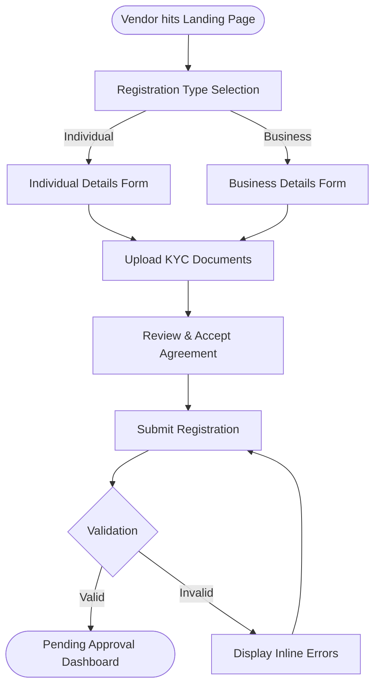
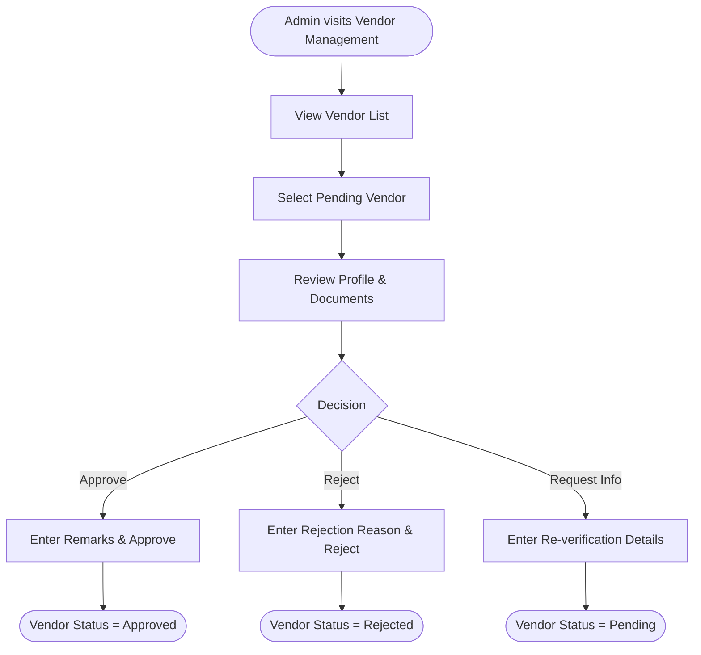

# Wireframes: Vendor Onboarding & Verification

> Generated: 2026-04-13
> Module: BP-001 Vendor Onboarding & Verification
> Source: [business-processes.md](./business-processes.md), [usecase-list.md](./usecase-list.md), [entity-model.md](./entity-model.md), [common-rules.md](./common-rules.md)

---

## 1. Task Flows

### 1.1 Vendor Registration Flow (Vendor Actor)



### 1.2 Vendor Moderation Flow (Admin Actor)



---

## 2. Low-Fidelity Wireframes

### 2.1 Screen: Registration Form (UC-VOB-001)

This screen allows the vendor to input their personal or business details to start the onboarding process.

```text
+-----------------------------------------------------------------------------+
|  [Logo]   MultiVendor Platform                       [Help] [Login]         |
+-----------------------------------------------------------------------------+
|                                                                             |
|  Register as a Vendor                                                       |
|                                                                             |
|  [1. Basic Details] ------ [2. Upload Documents] ------ [3. Agreement]      |
|                                                                             |
|  Vendor Type:                                                               |
|  (o) Individual   ( ) Business                     [1]                      |
|                                                                             |
|  First Name *                    Last Name *       [2]                      |
|  [Input First Name       ]       [Input Last Name        ]                  |
|                                                                             |
|  Email Address *                 Phone Number *                             |
|  [Input Email            ]       [Input Phone Number     ]                  |
|                                                                             |
|  Store Name *                                                               |
|  [Input Store Name                               ]                          |
|                                                                             |
|  Store Description                                                          |
|  [Input Store Description (Max 500 chars)        ] [3]                      |
|                                                                             |
|                                          [ Proceed to Next Step -> ] [4]    |
|                                                                             |
+-----------------------------------------------------------------------------+
```

**Annotations & Rules:**
* **[1] Vendor Type:** Determines required KYC docs in the next step. Radio buttons. (BR-023, RULE-002).
* **[2] Fields:** First Name, Last Name max 100 chars (COMMON-007). Required fields marked with `*` (COMMON-003). Email must be valid RFC 5322 (COMMON-019). Phone must be E.164 (COMMON-020).
* **[3] Description:** Max length 2000 characters per data standard but 500 characters applied for UI display constraint limits (COMMON-008, COMMON-009). Shows placeholder on focus (COMMON-010).
* **[4] Proceed:** Validates current step before moving to documents. Shows inline errors explicitly below fields (COMMON-032).

---

### 2.2 Screen: Document Upload (UC-VOB-002)

```text
+-----------------------------------------------------------------------------+
|  [Logo]   MultiVendor Platform                       [Help] [Login]         |
+-----------------------------------------------------------------------------+
|                                                                             |
|  Register as a Vendor                                                       |
|                                                                             |
|  [1. Basic Details] ------ [2. Upload Documents] ------ [3. Agreement]      |
|                                                                             |
|  Please upload your KYC Documents. Only PDF format is accepted.             |
|  Max size per file: 5MB.                                                    |
|                                                                             |
|  NIC / Passport *                Bank Proof *        [1]                    |
|  +------------------------+      +------------------------+                 |
|  | [Icon] Upload PDF      |      | [Icon] Upload PDF      |                 |
|  +------------------------+      +------------------------+                 |
|                                                                             |
|  Store Logo                                                                 |
|  +------------------------+      [2]                                        |
|  | [Icon] Upload Image    |                                                 |
|  +------------------------+                                                 |
|                                                                             |
|  [ <- Back ]                               [ Proceed to Next Step -> ] [3]  |
|                                                                             |
+-----------------------------------------------------------------------------+
```

**Annotations & Rules:**
* **[1] Documents:** Mandatory for Individual (NIC/Passport, Bank Proof). Business type requires BR Cert, Form 1/20, TIN/VAT, Director NIC. Max 5MB per file, PDF only (RULE-003, RULE-053). OS dialog limits selection to `.pdf` (COMMON-040).
* **[2] Logo:** Optional. JPEG/PNG/WebP format, Max 5MB. Shows visual thumbnail preview before submitting (COMMON-036).
* **[3] Proceed:** Checks if mandatory documents are uploaded. Progress indicator shown for files >1MB (COMMON-037). Option to remove file (COMMON-038).

---

### 2.3 Screen: Agreement & Submission (UC-VOB-003, UC-VOB-004)

```text
+-----------------------------------------------------------------------------+
|  [Logo]   MultiVendor Platform                       [Help] [Login]         |
+-----------------------------------------------------------------------------+
|                                                                             |
|  Register as a Vendor                                                       |
|                                                                             |
|  [1. Basic Details] ------ [2. Upload Documents] ------ [3. Agreement]      |
|                                                                             |
|  Vendor Agreement (v1.2) [1]                                                |
|  +-----------------------------------------------------------------------+  |
|  | Vendor Terms & Conditions                                             |  |
|  | 1. Introduction...                                                    |  |
|  | 2. Responsibilities...                                                |  |
|  | 3. Settlement & Commissions...                                        |  |
|  | ...                                                             [v]   |  |
|  +-----------------------------------------------------------------------+  |
|                                                                             |
|  [ ] I have read and accept the Vendor Agreement * [2]                      |
|                                                                             |
|  [ <- Back ]                                       [ Submit Registration ]  |
|                                                                             |
|                            [Toast: Registration Submitted Successfully!] [3]|
+-----------------------------------------------------------------------------+
```

**Annotations & Rules:**
* **[1] Agreement Text:** Displays latest active vendor agreement (RULE-012, BR-025). Scrollable text view.
* **[2] Checkbox:** Required. Acceptance version and timestamp recorded alongside registration (UC-VOB-003).
* **[3] Submit:** Performs final verification of all 3 tabs (UC-VOB-004). Disables submit button after first click to prevent double submission (COMMON-015). Success toast auto-dismisses in 5s (COMMON-013). Status progresses to `Pending`. Shows Loading spinner if async op > 300ms (COMMON-012).

---

### 2.4 Screen: Admin Vendor List (UC-VOB-005)

```text
+-----------------------------------------------------------------------------+
|  [Admin Logo]   MultiVendor Admin Dashboard                     [Profile]   |
+-----------------------------------------------------------------------------+
|  [Menu] |  Vendors > Vendor List                                            |
|  Dash   |                                                                   |
|  Vendors|  Search: [ Input Vendor Name... ] [Search] [1]                    |
|  Product|  Filter: [ Status: All (v) ] [ Type: All (v) ]                    |
|  Orders |                                                                   |
|  Returns|  +----------------------------------------------------------+  [2]|
|  ...    |  | Store Name  | Type       | Reg Date   | Status   | Act.  |     |
|         |  |-------------|------------|------------|----------|-------|     |
|         |  | Tech Store  | Business   | 13/04/2026 | Pending  | [View]|     |
|         |  | Bob's Goods | Individual | 12/04/2026 | Approved | [View]|     |
|         |  | Alice Shop  | Individual | 11/04/2026 | Rejected | [View]|     |
|         |  +----------------------------------------------------------+     |
|         |                                                                   |
|         |  Showing 1-20 of 150 items     [<] Page 1 of 8 [>]     [3]        |
+-----------------------------------------------------------------------------+
```

**Annotations & Rules:**
* **[1] Search & Filter:** Search min query length 2 chars before triggering (COMMON-006). Filtering/searching maintains pagination state (COMMON-058).
* **[2] Table Data:** Rows have hover highlight for readability (COMMON-018). The empty state shows a descriptive message if no vendors exist (COMMON-056).
* **[3] Pagination:** Default 20 items per page. Options for 10, 20, 50, 100 (COMMON-052, COMMON-053). Date format DD/MM/YYYY (COMMON-021). Click on View row opens Vendor Detail (UC-VOB-006).

---

### 2.5 Screen: Admin Vendor Review (UC-VOB-006, UC-VOB-007, UC-VOB-008, UC-VOB-009)

```text
+-----------------------------------------------------------------------------+
|  [Admin Logo]   MultiVendor Admin Dashboard                     [Profile]   |
+-----------------------------------------------------------------------------+
|  [Menu] |  Vendors > Vendor List > Tech Store Review                        |
|         |                                                                   |
|         |  [ < Back to List ]                                               |
|         |                                                                   |
|         |  STORE: Tech Store     STATUS: [PENDING]                          |
|         |  TYPE:  Business       DATE:   13/04/2026                         |
|         |                                                                   |
|         |  +------------------------+  +---------------------------------+  |
|         |  | KYC Documents      [1] |  | Action Required             [2] |  |
|         |  | - BR_Cert.pdf [View]   |  |                                 |  |
|         |  | - TIN_VAT.pdf [View]   |  | Remarks / Rejection Reason *    |  |
|         |  | - BankProof.pdf [View] |  | [Type reason here...]           |  |
|         |  +------------------------+  |                                 |  |
|         |  +------------------------+  | [ Request Re-verify ]           |  |
|         |  | Bank & Contact Info    |  | [ Reject Vendor ]               |  |
|         |  | Email: t@tech.com      |  | [ Approve Vendor ]          [3] |  |
|         |  | Phone: +1234567890     |  +---------------------------------+  |
|         |  +------------------------+                                       |
+-----------------------------------------------------------------------------+
```

**Annotations & Rules:**
* **[1] KYC Review:** Admin verifies the uploaded PDFs (RULE-004). Clicking [View] opens PDF in new tab or modal.
* **[2] Actions:** Remarks required for all decisions (Reject, Approve, Request Re-verify) (RULE-010). Text area max length 2,000 characters (COMMON-002).
* **[3] Approve/Reject:** Must trigger a confirmation dialog (e.g. "Are you sure you want to approve this vendor?") to prevent accidental decisional actions (COMMON-014).
* Upon confirmation, the UI disables the submit button blocking double requests (COMMON-015). Success completes UC-VOB-007/008 and displays a success toast (COMMON-017).

---

## 3. Interaction Map

| Trigger Element | Source View | Target View | Action Result |
|-----------------|-------------|-------------|---------------|
| `[Proceed to Next Step]` | Basic Details | Upload Documents | Moves to Tab 2 if all validations pass. |
| `[Proceed to Next Step]` | Upload Documents | Agreement | Moves to Tab 3 if KYC requirements met. |
| `[Submit Registration]` | Agreement | Success Dashboard | Completes User/Vendor creation, redirects. |
| `[View]` in Vendor List | Admin Vendor List | Admin Vendor Review | Loads vendor profile data by ID. |
| `[Approve Vendor]` | Admin Vendor Review | Confirmation Modal | Prompts Admin confirmation to change status to Approved. |
| `[Confirm]` (Modal) | Confirmation Modal | Admin Vendor List | Submits approval, shows success toast. |

---

## 4. Open Questions

1. **Email Verification:** Is OTP based email verification intended as part of Registration or post-registration? (Wireframe assumes post-registration or via link).
2. **Auto OCR Extraction:** Is OCR integrated during Document Upload for form pre-filling, or relies entirely on manual Admin review? (Wireframes reflect manual check logic).
